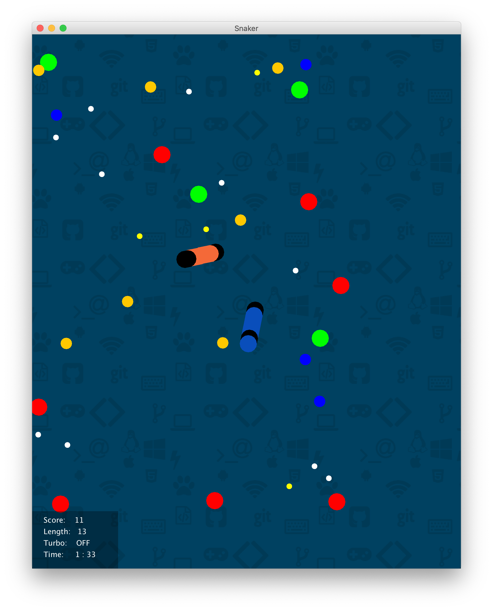

# SlitherClone
Clone of the known the Slither.io Game for my college project.

It uses socket to communicate. One computer is used to serve the game. That computer and other clients connect to server computer to join game. This is not a fully game. For now, players only can move and grow by eating foods. Some foods can decrease the size of players lengths. Players can select their background on the list.

